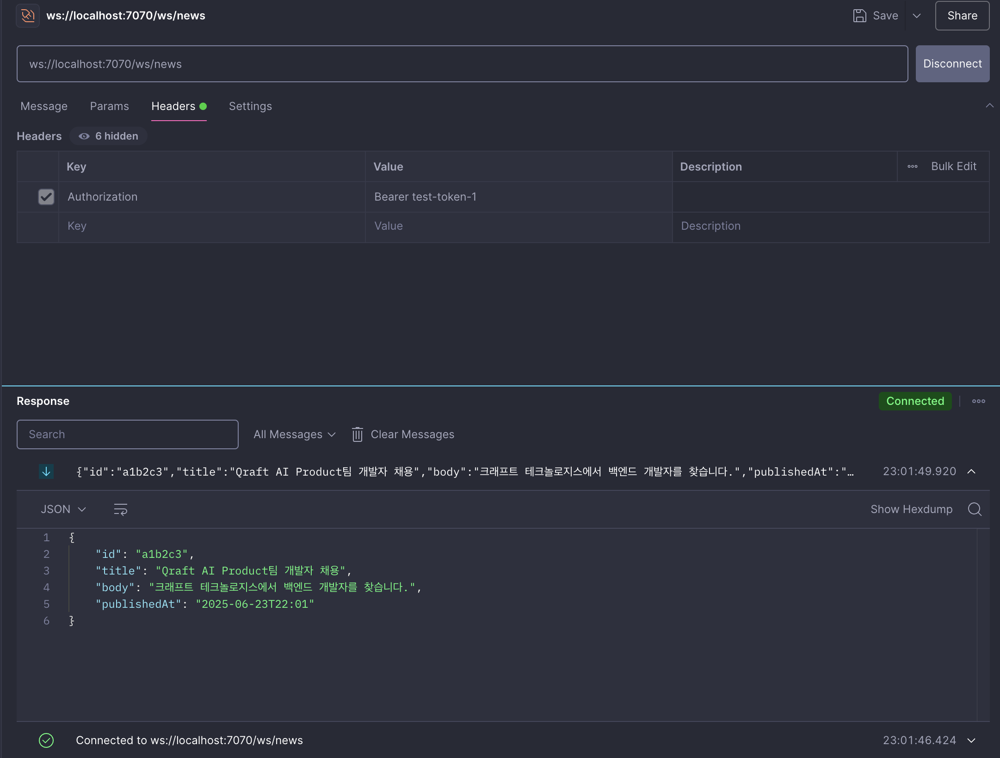
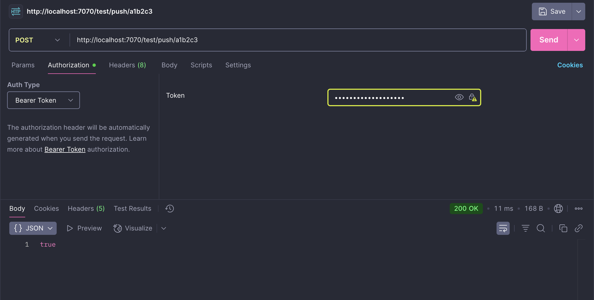

## 기술 스택
| 구성요소 | 기술 스택 | 버전 |
| :---: | :---: | :----:|
| Language | Java | 17 |
| Framework | Spring Boot | 3.5.3 |
| Build | Gradle | 8.x (Wrapper 기준) |
| WebSocket | Spring Web / WebSocket | 3.5.3 |
| ORM | Spring Data JPA | 3.2.x |
| DB | PostgreSQL | 15(Docker) |
| Logging | SLF4J + Logback | 기본|


## 실행방법
1. PostgreSQL (Docker Compose)
    ```
    docker compose up -d
    ```
   - 포트 : 5432
   - DB : qraft
   - 사용자 : qraftuser / qraftpass
   
<br/>
   
2. Spring Boot 서버 실행 
    ```
    ./gradlew bootRun
   ```
   기본 포트 : 7070

## 테스트용 API
   ```
   POST /test/push/{id}
   ```
- 특정 뉴스 ID를 큐에 수동으로 넣고, 연결된 모든 클라이언트에게 WebSocket으로 브로드캐스트하는 흐름을 테스트할 수 있습니다.
이 API는 dev 프로파일에서만 활성화됩니다. 
  - **dev 프로파일에서만 동작합니다**
    - 활성화 방법
      - application.properties 설정
      ```
      spring.profiles.active=dev
      ```


## WebSocket 연결 방법
- 엔드포인트 
   ```
   ws://localhost:7070/ws/news
  ```
- 헤더
  - WebSocket 요청시 다음과 같이 Authorization 헤더를 추가해야 합니다.

| Header | Value |
| :---: | :---: |
| Authorization | Bearer test-token-1 |

- 주의!! 일부 WebSocket 테스트 툴(WebSocket King Client)에서는 일반 헤더 설정이 불가능합니다. Postman 테스트 권장!





## 예외 처리 구조
| 예외 상황 | 처리 방식 |
| :----: | :----:|
| 뉴스 ID 조회 실패 | NewsNotFountException (로그 경고) |
| 웹소켓 메시지 전송 실패 | WebSocketSendException (로그 에러) |
| 연결 오류 | hanleTransportError() 에서 로그 처리 |
| Token누락 또는 유효하지 않음 | InvalidException (연결 거부 및 로그 warn) |
| 중복 연결(동일 토큰) | 기존 세션 종료 후 새로운 세션 등록(로그 info) |


## 시나리오 테스트 가이드
| 시나리오 | 기대 결과 |
| :----: | :---: |
| 유효한 토큰으로 WebSocket 연결 | 연결 유지 및 실시간 수신 가능 |
| 토큰 없이 연결 | 서버에거 연결 거절(CloseStatus 1008) |
| 중복 토큰 연결 | 두번째 연결 거절(POLICY_VIOLATION) |
| 잘못된 토큰 형식 | 연결 거절 |
| 존재하지 않는 뉴스 ID | false 또는 404 응답|


## 향후 AWS SQS 전환시 변경되어야 할 부분
1. Queue 구현체
   - 현재 InMemoryQueue를 사용하고 있는데, 나중에 SqsQueue 같은 클래스를 새로 만들어서 SQS랑 연결해야 합니다.
   - 인터페이스인 NewsQueue는 그대로 두고 구현체만 바꾸면 됩니다.

2. 설정
   - 현재는 메모리 큐(LinkedBlockingQueue) 사용하지만, 
   - 추후 SQS로 변경시 application-prod.yml 같은 설정 파일을 통해 sqs url, region, access key 같은 설정 값을 추가해야 합니다.

3. 빈 주입
   - InMemoryQueue는 @Component로 되어 있어 SQS 구현체는 @Profile("prod")로 바꿔 prod 환경에서만 등록되도록 설정 해야한다 생각합니다. 

