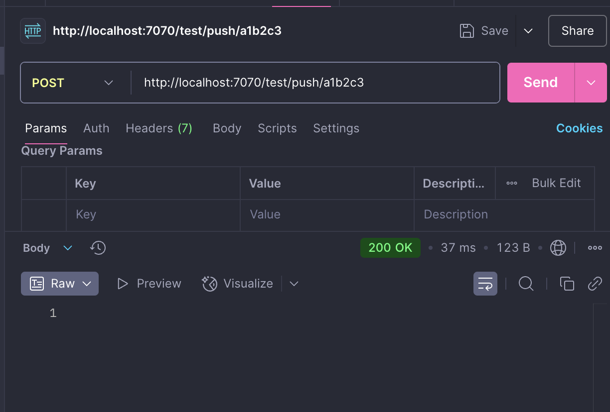
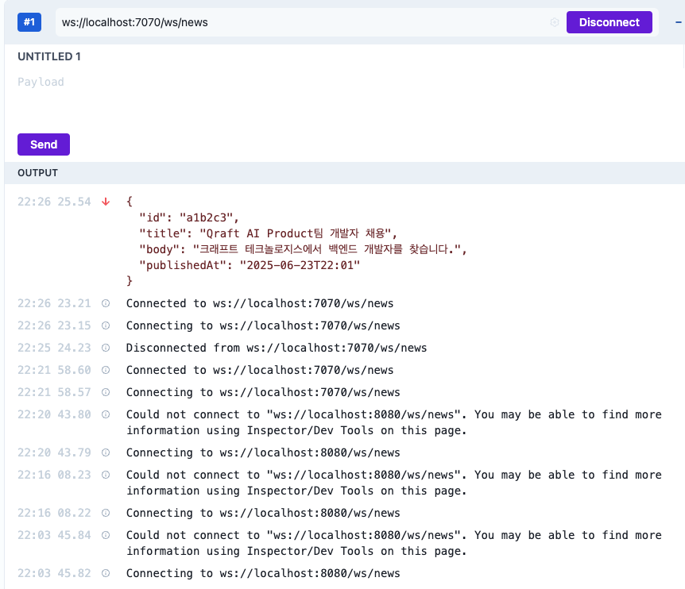

## 기술 스택
| 구성요소 | 기술 스택 | 버전 |
| :---: | :---: | :----:|
| Language | Java | 17 |
| Framework | Spring Boot | 3.5.3 |
| Build | Gradle | 8.x (Wrapper 기준) |
| WebSocket | Spring Web / WebSocket | 3.5.3 |
| ORM | Spring Data JPA | 3.2.x |
| DB | PostgreSQL | 15(Docker) |
| Logging | SLF4J + Logback | 기본|


## 실행방법
1. PostgreSQL (Docker Compose)
    ```
    docker compose up -d
    ```
   - 포트 : 5432
   - DB : qraft
   - 사용자 : qraftuser / qraftpass
   
<br/>
   
2. Spring Boot 서버 실행 
    ```
    ./gradlew bootRun
   ```
   기본 포트 : 7070

## 테스트 API
POST /test/push/{id}

큐에 뉴스 ID를 강제로 사빕하면 전송 흐름 확인할 수 있습니다.
이 API는 dev 프로파일에서만 활성화됩니다. 


## WebSocket 연결 방법
- 엔드포인트 : ws://localhost:7070/ws/nes
- 연결후, 테스트 API로 뉴스 ID를 push하면 메시지가 브로드 캐스트됩니다.



## 예외 처리 구조
| 예외 상황 | 처리 방식 |
| :----: | :----:|
| 뉴스 ID 조회 실패 | NewsNotFountException (로그 경고) |
| 웹소켓 메시지 전송 실패 | WebSocketSendException (로그 에러) |
| 연결 오류 | hanleTransportError() 에서 로그 처리 |


